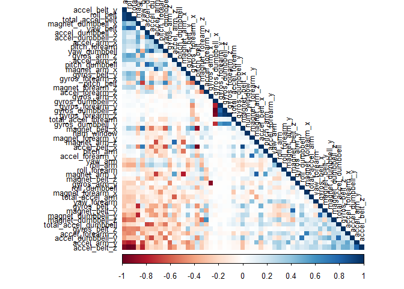
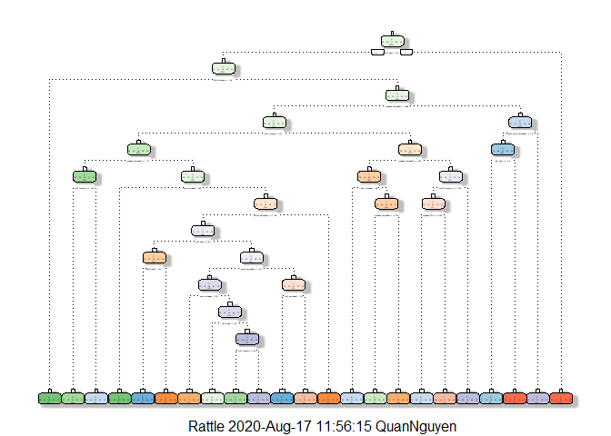
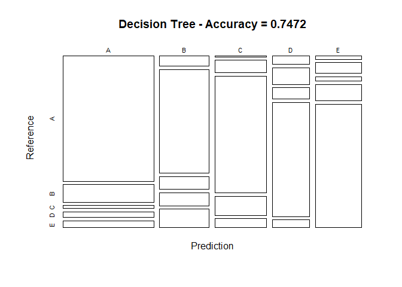
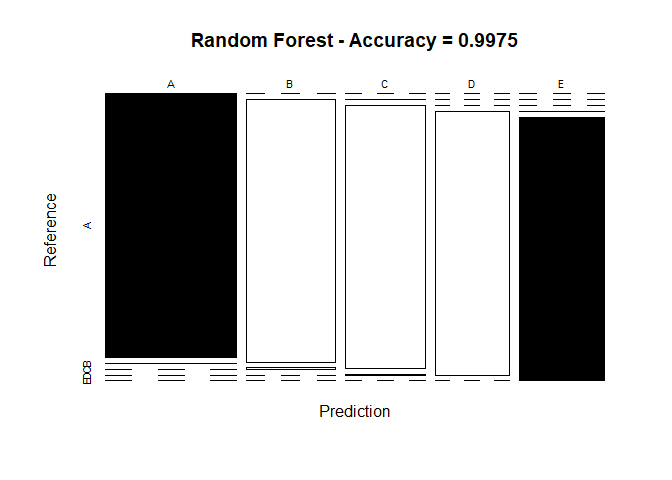
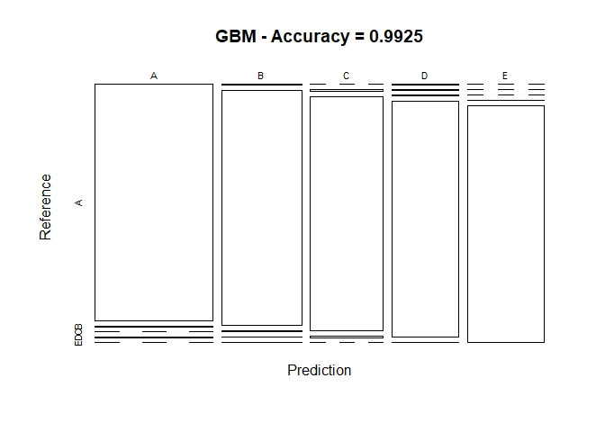

Prediction-Assignment-Writeup
-----------------------------

Background

Using devices such as Jawbone Up, Nike FuelBand, and Fitbit it is now
possible to collect a large amount of data about personal activity
relatively inexpensively. These type of devices are part of the
quantified self movement - a group of enthusiasts who take measurements
about themselves regularly to improve their health, to find patterns in
their behavior, or because they are tech geeks. One thing that people
regularly do is quantify how much of a particular activity they do, but
they rarely quantify how well they do it. In this project, your goal
will be to use data from accelerometers on the belt, forearm, arm, and
dumbell of 6 participants. They were asked to perform barbell lifts
correctly and incorrectly in 5 different ways. More information is
available from the website here:
<a href="http://groupware.les.inf.puc-rio.br/har" class="uri">http://groupware.les.inf.puc-rio.br/har</a>
(see the section on the Weight Lifting Exercise Dataset).

Data

The training data for this project are available here:

<a href="https://d396qusza40orc.cloudfront.net/predmachlearn/pml-training.csv" class="uri">https://d396qusza40orc.cloudfront.net/predmachlearn/pml-training.csv</a>

The test data are available here:

<a href="https://d396qusza40orc.cloudfront.net/predmachlearn/pml-testing.csv" class="uri">https://d396qusza40orc.cloudfront.net/predmachlearn/pml-testing.csv</a>

The data for this project come from this source:
<a href="http://groupware.les.inf.puc-rio.br/har" class="uri">http://groupware.les.inf.puc-rio.br/har</a>.
If you use the document you create for this class for any purpose please
cite them as they have been very generous in allowing their data to be
used for this kind of assignment.

I. Essential Packages
=====================

    library(knitr)
    library(caret)

    ## Loading required package: lattice

    ## Loading required package: ggplot2

    library(rpart)
    library(rpart.plot)
    library(rattle)

    ## Loading required package: tibble

    ## Loading required package: bitops

    ## Rattle: A free graphical interface for data science with R.
    ## Version 5.4.0 Copyright (c) 2006-2020 Togaware Pty Ltd.
    ## Type 'rattle()' to shake, rattle, and roll your data.

    library(randomForest)

    ## randomForest 4.6-14

    ## Type rfNews() to see new features/changes/bug fixes.

    ## 
    ## Attaching package: 'randomForest'

    ## The following object is masked from 'package:rattle':
    ## 
    ##     importance

    ## The following object is masked from 'package:ggplot2':
    ## 
    ##     margin

    library(corrplot)

    ## corrplot 0.84 loaded

    #Set seed for reproducability
    set.seed(1234)

II. Data Processing
===================

    TrainUrl <- "https://d396qusza40orc.cloudfront.net/predmachlearn/pml-training.csv"
    TestUrl  <- "https://d396qusza40orc.cloudfront.net/predmachlearn/pml-testing.csv"
    TrainFile<-"pml-traininig.csv"
    TestFile<-"pml-testing.csv"

    # download the datasets
    if(!file.exists(TrainFile))
    {
        download.file(TrainUrl,destfile = TrainFile)
    }
    training <- read.csv(TrainFile)
    if(!file.exists(TestFile))
    {
        download.file(TestUrl,destfile = TestFile)
    }
    testing  <- read.csv(TestFile)

    # create a partition using caret with the training dataset on 70,30 ratio
    inTrain  <- createDataPartition(training$classe, p=0.7, list=FALSE)

    TrainSet <- training[inTrain, ]

    TestSet  <- training[-inTrain, ]

    dim(TrainSet)

    ## [1] 13737   160

    dim(TestSet)

    ## [1] 5885  160

III. Cleaning data
==================

    # remove variables with Nearly Zero Variance
    NZV <- nearZeroVar(TrainSet)
    TrainSet <- TrainSet[, -NZV]
    TestSet  <- TestSet[, -NZV]

    # remove variables that are mostly NA
    AllNA    <- sapply(TrainSet, function(x) mean(is.na(x))) > 0.95
    TrainSet <- TrainSet[, AllNA==FALSE]
    TestSet  <- TestSet[, AllNA==FALSE]

    # remove identification only variables (columns 1 to 5)
    TrainSet <- TrainSet[, -(1:5)]
    TestSet  <- TestSet[, -(1:5)]

    # Check for the datasets dimemsions
    dim(TrainSet)

    ## [1] 13737    54

    dim(TestSet)

    ## [1] 5885   54

IV. Correlation Analysis
========================

    corMatrix <- cor(TrainSet[, -54])
    corrplot(corMatrix, order = "FPC", method = "color", type = "lower", 
             tl.cex = 0.8, tl.col = rgb(0, 0, 0))

V. Prediction Models
====================

In this report, three popular models will be applied to model the
regressions (in the Train-set) and the best one (with highest accuracy
when applied to the Test-set) will be used for the quiz predictions.
Three methods are Decision Tree, Random Forest, and Generalized Boosted
Model. Besides, the Confusion Matrix is plotted at the end of each
analysis to visualize the accuracy of the models. 1. Decision Tree

    # Fitting model
    modFitDT <- rpart(classe ~ ., data=TrainSet, method="class")
    fancyRpartPlot(modFitDT)

    ## Warning: labs do not fit even at cex 0.15, there may be some overplotting

    # Prediction on Test dataset
    predictDT <- predict(modFitDT, newdata=TestSet, type="class")

    # Evaluating
    confMatDT <- confusionMatrix(predictDT, factor(TestSet$classe))
    confMatDT

    ## Confusion Matrix and Statistics
    ## 
    ##           Reference
    ## Prediction    A    B    C    D    E
    ##          A 1539  214   36   70   82
    ##          B   68  690   87   86  124
    ##          C    5   86  818  132   63
    ##          D   42   83   57  576   39
    ##          E   20   66   28  100  774
    ## 
    ## Overall Statistics
    ##                                           
    ##                Accuracy : 0.7472          
    ##                  95% CI : (0.7358, 0.7582)
    ##     No Information Rate : 0.2845          
    ##     P-Value [Acc > NIR] : < 2.2e-16       
    ##                                           
    ##                   Kappa : 0.6782          
    ##                                           
    ##  Mcnemar's Test P-Value : < 2.2e-16       
    ## 
    ## Statistics by Class:
    ## 
    ##                      Class: A Class: B Class: C Class: D Class: E
    ## Sensitivity            0.9194   0.6058   0.7973  0.59751   0.7153
    ## Specificity            0.9045   0.9231   0.9411  0.95509   0.9554
    ## Pos Pred Value         0.7929   0.6540   0.7409  0.72271   0.7834
    ## Neg Pred Value         0.9658   0.9070   0.9565  0.92374   0.9371
    ## Prevalence             0.2845   0.1935   0.1743  0.16381   0.1839
    ## Detection Rate         0.2615   0.1172   0.1390  0.09788   0.1315
    ## Detection Prevalence   0.3298   0.1793   0.1876  0.13543   0.1679
    ## Balanced Accuracy      0.9119   0.7644   0.8692  0.77630   0.8354

    # plot matrix results
    plot(confMatDT$table, col = confMatDT$byClass, 
         main = paste("Decision Tree - Accuracy =",
                      round(confMatDT$overall['Accuracy'], 4)))

1.  Random Forest

<!-- -->

    # Fitting model
    controlRF <- trainControl(method="cv", number=3, verboseIter=FALSE)

    # Training on Train dataset
    modFitRF <- train(classe ~ ., data=TrainSet, method="rf", trControl=controlRF)

    modFitRF$finalModel

    ## 
    ## Call:
    ##  randomForest(x = x, y = y, mtry = param$mtry) 
    ##                Type of random forest: classification
    ##                      Number of trees: 500
    ## No. of variables tried at each split: 27
    ## 
    ##         OOB estimate of  error rate: 0.21%
    ## Confusion matrix:
    ##      A    B    C    D    E  class.error
    ## A 3905    0    0    0    1 0.0002560164
    ## B    6 2650    1    1    0 0.0030097818
    ## C    0    8 2388    0    0 0.0033388982
    ## D    0    0    8 2244    0 0.0035523979
    ## E    0    0    0    4 2521 0.0015841584

    # Prediction on Test dataset
    predictRF <- predict(modFitRF, newdata=TestSet)

    # Evaluating
    confMatRF <- confusionMatrix(predictRF, factor(TestSet$classe))

    confMatRF

    ## Confusion Matrix and Statistics
    ## 
    ##           Reference
    ## Prediction    A    B    C    D    E
    ##          A 1674    3    0    0    0
    ##          B    0 1135    6    0    0
    ##          C    0    1 1020    4    0
    ##          D    0    0    0  959    0
    ##          E    0    0    0    1 1082
    ## 
    ## Overall Statistics
    ##                                           
    ##                Accuracy : 0.9975          
    ##                  95% CI : (0.9958, 0.9986)
    ##     No Information Rate : 0.2845          
    ##     P-Value [Acc > NIR] : < 2.2e-16       
    ##                                           
    ##                   Kappa : 0.9968          
    ##                                           
    ##  Mcnemar's Test P-Value : NA              
    ## 
    ## Statistics by Class:
    ## 
    ##                      Class: A Class: B Class: C Class: D Class: E
    ## Sensitivity            1.0000   0.9965   0.9942   0.9948   1.0000
    ## Specificity            0.9993   0.9987   0.9990   1.0000   0.9998
    ## Pos Pred Value         0.9982   0.9947   0.9951   1.0000   0.9991
    ## Neg Pred Value         1.0000   0.9992   0.9988   0.9990   1.0000
    ## Prevalence             0.2845   0.1935   0.1743   0.1638   0.1839
    ## Detection Rate         0.2845   0.1929   0.1733   0.1630   0.1839
    ## Detection Prevalence   0.2850   0.1939   0.1742   0.1630   0.1840
    ## Balanced Accuracy      0.9996   0.9976   0.9966   0.9974   0.9999

    # plot matrix results
    plot(confMatRF$table, col = confMatRF$byClass, 
         main = paste("Random Forest - Accuracy =",
                      round(confMatRF$overall['Accuracy'], 4)))

1.  Generalized Boosted Model (GBM)

<!-- -->

    # Fitting model
    controlGBM <- trainControl(method = "repeatedcv", number = 5, repeats = 1)

    # Training on Train dataset
    modFitGBM  <- train(classe ~ ., data=TrainSet, method = "gbm", trControl = controlGBM, verbose = FALSE)

    modFitGBM$finalModel

    ## A gradient boosted model with multinomial loss function.
    ## 150 iterations were performed.
    ## There were 53 predictors of which 53 had non-zero influence.

    # Prediction on Test dataset
    predictGBM <- predict(modFitGBM, newdata=TestSet)

    # Evaluating
    confMatGBM <- confusionMatrix(predictGBM, factor(TestSet$classe))
    confMatGBM

    ## Confusion Matrix and Statistics
    ## 
    ##           Reference
    ## Prediction    A    B    C    D    E
    ##          A 1671    6    0    3    0
    ##          B    2 1123    6    3    1
    ##          C    0    9 1018    7    0
    ##          D    1    1    2  950    2
    ##          E    0    0    0    1 1079
    ## 
    ## Overall Statistics
    ##                                         
    ##                Accuracy : 0.9925        
    ##                  95% CI : (0.99, 0.9946)
    ##     No Information Rate : 0.2845        
    ##     P-Value [Acc > NIR] : < 2.2e-16     
    ##                                         
    ##                   Kappa : 0.9905        
    ##                                         
    ##  Mcnemar's Test P-Value : NA            
    ## 
    ## Statistics by Class:
    ## 
    ##                      Class: A Class: B Class: C Class: D Class: E
    ## Sensitivity            0.9982   0.9860   0.9922   0.9855   0.9972
    ## Specificity            0.9979   0.9975   0.9967   0.9988   0.9998
    ## Pos Pred Value         0.9946   0.9894   0.9845   0.9937   0.9991
    ## Neg Pred Value         0.9993   0.9966   0.9984   0.9972   0.9994
    ## Prevalence             0.2845   0.1935   0.1743   0.1638   0.1839
    ## Detection Rate         0.2839   0.1908   0.1730   0.1614   0.1833
    ## Detection Prevalence   0.2855   0.1929   0.1757   0.1624   0.1835
    ## Balanced Accuracy      0.9980   0.9917   0.9945   0.9921   0.9985

    # plot matrix results
    plot(confMatGBM$table, col = confMatGBM$byClass, 
         main = paste("GBM - Accuracy =", round(confMatGBM$overall['Accuracy'], 4)))

VI. APPLYING THE BEST MODEL TO PREDICT 20 DIFFERENT TEST CASES
==============================================================

The accuracy of 3 selected regression models above are listed in order
of performance as Random Forest &gt; GBM &gt; Decision Tree. Therefore,
the Random Forest model will be applied to predict the 20 quiz results
(testing dataset) as shown below.

    # Perform prediction
    predictTEST <- predict(modFitRF, newdata=testing)
    predictTEST

    ##  [1] B A B A A E D B A A B C B A E E A B B B
    ## Levels: A B C D E
